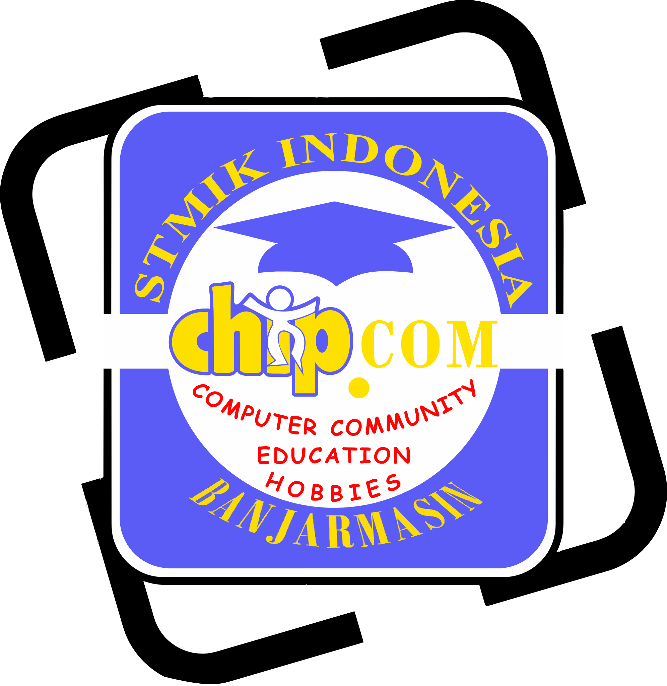

<div align="center">
  
  <h1>CHIP.COM Website</h1>
  <p><strong>Official Web Portal of UKM Chip.Com &bull; STMIK Indonesia Banjarmasin</strong></p>

  <p>
    <a href="https://chipcom.vercel.app/" target="_blank">
      
    </a>
    
    
  </p>

  <p>
    
    
    
    
    
  </p>
</div>

---

## 📖 Table of Contents

- [About The Project](#-about-the-project)
- [Key Features](#-key-features)
- [Site Pages & Architecture](#-site-pages--architecture)
- [Tech Stack](#-tech-stack)
- [Directory Structure](#-directory-structure)
- [Getting Started](#-getting-started)
  - [Prerequisites](#prerequisites)
  - [Running Locally](#running-locally)
- [Deployment & Routing](#-deployment--routing)
- [Roadmap & Version History](#-roadmap--version-history)
- [Contact & Organization](#-contact--organization)
- [License](#-license)

---

## 📌 About The Project

**UKM Chip.Com** is a premier Student Activity Unit (*Unit Kegiatan Mahasiswa*) at **STMIK Indonesia Banjarmasin**, dedicated to fostering student excellence in Information Technology (software, hardware, and creative digital skills) along with strong organizational leadership and teamwork.

This repository hosts the official front-facing website of UKM Chip.Com. It serves as an informative hub for prospective members, current students, campus faculty, and external partners to explore the organization's history, vision and mission, leadership hierarchy, and event documentation.

---

## ✨ Key Features

- **🌙 Dual-Theme Mode (Light & Dark)**:
  - Supports dynamic toggling between light and dark visual themes.
  - State persisted locally via `localStorage`.
  - Built-in FOUC (*Flash of Unstyled Content*) prevention logic executed prior to body render.
  - Fluid rotation and icon transition animations between sun and moon states.

- **🖼️ Interactive Hero Slideshow**:
  - Automated timed transition with pause-on-hover capability.
  - Manual navigation via previous/next chevron buttons and clickable dot indicators.
  - Performance optimization using lazy background image hydration (`data-bg`).

- **🧭 Dynamic Navigation System**:
  - Sliding pill indicator for desktop viewports that tracks and highlights the active route with smooth cubic-bezier transitions.
  - Collapsible slide-out mobile drawer menu triggered by a hamburger button with click-outside auto-dismissal.

- **⚡ Performance & Smooth Motion**:
  - Scroll-triggered reveal animations powered by the `IntersectionObserver` API (`.fade-in-up`).
  - Floating smooth-scroll "Back to Top" button appearing dynamically when scrolling past a threshold.
  - Preloaded and WebP-optimized imagery for fast loading and reduced bandwidth consumption.

- **🔍 SEO & Social Media Optimization**:
  - Open Graph (OG) meta tags configured on all main pages for rich previews on platforms such as WhatsApp, LinkedIn, Discord, and Twitter/X.
  - Semantic HTML5 structure adhering to modern web accessibility best practices.

---

## 📄 Site Pages & Architecture

| Route | File | Description |
| :--- | :--- | :--- |
| `/` or `/beranda` | [`index.html`](file:///d:/Code/Personal%20Project/chipcom/index.html) | Landing page featuring the hero carousel, call-to-action to join, and campus location map. |
| `/category/sejarah` | [`sejarah.html`](file:///d:/Code/Personal%20Project/chipcom/sejarah.html) | Historical journey from DosCom (1999) to the rebirth and formalization of UKM Chip.Com. |
| `/category/visimisi` | [`visimisi.html`](file:///d:/Code/Personal%20Project/chipcom/visimisi.html) | Core vision and strategic missions in IT literacy, unity, and community service. |
| `/category/struktur` | [`struktur.html`](file:///d:/Code/Personal%20Project/chipcom/struktur.html) | Organizational hierarchy, divisional duties (Education, PR, Logistics, Core Executives). |
| `/category/dokumentasi` | [`dokumentasi.html`](file:///d:/Code/Personal%20Project/chipcom/dokumentasi.html) | Activity gallery (Basic Training / PEDAS, Workshops, Dies Natalis) with social links. |
| Custom 404 | [`404.html`](file:///d:/Code/Personal%20Project/chipcom/404.html) | Custom not-found error page with quick navigation back to home. |

---

## 🛠️ Tech Stack

- **Markup**: [HTML5](https://developer.mozilla.org/en-US/docs/Web/HTML) (Semantic & accessible)
- **Styling**: [CSS3](https://developer.mozilla.org/en-US/docs/Web/CSS) (CSS Custom Properties / Variables, Flexbox, Grid, Keyframe Animations)
- **Scripting**: Vanilla [JavaScript](https://developer.mozilla.org/en-US/docs/Web/JavaScript) (ES6+, DOM Manipulation, Intersection Observer API)
- **Typography**: [Plus Jakarta Sans](https://fonts.google.com/specimen/Plus+Jakarta+Sans) via Google Fonts
- **Iconography**: [Font Awesome 6](https://fontawesome.com/)
- **Hosting & Deployment**: [Vercel](https://vercel.com/)

---

## 📂 Directory Structure

```text
chipcom/
├── CSS/
│   └── style.css            # Central stylesheet (theme variables, layout, animations, responsive design)
├── JS/
│   └── script.js            # Main client-side script (theme toggle, slideshow, drawer, navigation)
├── images/                  # Static media assets (SVG logo, WebP activity photographs, banners)
├── 404.html                 # Custom 404 page
├── index.html               # Home / Landing page
├── sejarah.html             # History page
├── visimisi.html            # Vision & Mission page
├── struktur.html            # Organizational Structure page
├── dokumentasi.html         # Event Documentation gallery page
├── vercel.json              # Vercel routing configuration & clean URL rewrites
└── README.md                # Project documentation
```

---

## 🚀 Getting Started

### Prerequisites

Because this project is built entirely on native web standards (HTML/CSS/JS), **no build step, bundler, or package installation is required**.

### Running Locally

You can run and preview the website locally using any static web server:

#### Option 1: VS Code Live Server
1. Open this repository folder in Visual Studio Code.
2. Install the **Live Server** extension (by Ritwick Dey).
3. Right-click on [`index.html`](file:///d:/Code/Personal%20Project/chipcom/index.html) and select **"Open with Live Server"**.

#### Option 2: Python HTTP Server
```bash
# Python 3.x
python -m http.server 8000
```
Then visit `http://localhost:8000` in your web browser.

#### Option 3: Node.js `serve`
```bash
npx serve .
```

---

## 🌐 Deployment & Routing

The project is preconfigured for deployment on **Vercel** via [`vercel.json`](file:///d:/Code/Personal%20Project/chipcom/vercel.json):

```json
{
  "cleanUrls": true,
  "rewrites": [
    {
      "source": "/beranda",
      "destination": "/"
    },
    {
      "source": "/category/:path",
      "destination": "/:path"
    }
  ]
}
```

This configuration enables:
- **Clean URLs**: Strips `.html` extensions automatically from browser URLs.
- **Rewrites**: Provides SEO-friendly category paths (e.g. `/category/sejarah` routes seamlessly to `/sejarah.html`).

---

## 🗺️ Roadmap & Version History

### Current Release: `v2.6`
- [x] Dual-theme switching (Light & Dark) with local storage persistence.
- [x] Responsive layout with desktop sliding indicator and mobile drawer.
- [x] Clean routing and rewrite configuration for Vercel.
- [x] Hero carousel with manual and automated controls.

### Upcoming Milestones
- [ ] Add an interactive modal/lightbox slider for event documentation on [`dokumentasi.html`](file:///d:/Code/Personal%20Project/chipcom/dokumentasi.html).
- [ ] Update organizational chart visualization with interactive tree/card components on [`struktur.html`](file:///d:/Code/Personal%20Project/chipcom/struktur.html).
- [ ] Link and configure custom top-level domain (TLD).

---

## 📞 Contact & Organization

- **Organization**: UKM Chip.Com STMIK Indonesia Banjarmasin
- **Address**: Jl. Pangeran Hidayatullah, Sungai Jingah, Banjarmasin Utara, Kota Banjarmasin, Kalimantan Selatan 70122
- **Instagram**: [@chipcomstmik_id](https://instagram.com/chipcomstmik_id)
- **WhatsApp**: [+62 822-5185-5328](https://wa.me/6282251855328)
- **Live Website**: [chipcom.vercel.app](https://chipcom.vercel.app/)

---

## ⚖️ License

&copy; 2026 **UKM Chip.Com STMIK Indonesia Banjarmasin**. All rights reserved.